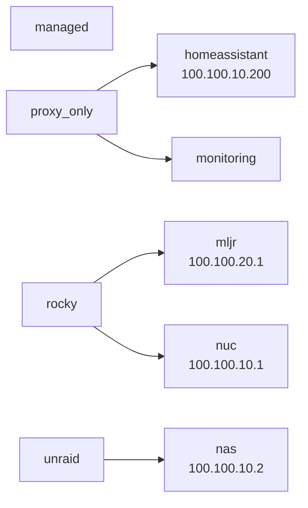

# Ansible Homelab Map

Generated from `ansible/inventory/hosts.yml` and `ansible/inventory/group_vars/all/all.yml`.

## Summary

- Hosts: 5
- Inventory groups: 4
- Enabled services: 30
- Managed Compose services: 17
- Proxy-only services: 10

## Inventory

## Service Placement

```mermaid
flowchart LR
  svc_authelia["authelia<br/>managed<br/>auth.mljr.eu"]
  svc_authelia --> host_mljr
  svc_bichon["bichon<br/>managed<br/>mail-archive.mljr.eu"]
  svc_bichon --> host_nuc
  svc_cglab["cglab<br/>managed<br/>cglab.mljr.eu"]
  svc_cglab --> host_nuc
  svc_crowdsec["crowdsec<br/>managed<br/>crowdsec.mljr.eu, security.mljr.eu"]
  svc_crowdsec --> host_mljr
  svc_diun["diun<br/>managed"]
  svc_diun --> host_mljr
  svc_dockhand["dockhand<br/>proxy only<br/>dockhand.mljr.eu"]
  svc_dockhand --> host_nas
  svc_filerun["filerun<br/>proxy only<br/>files.mljr.eu"]
  svc_filerun --> host_nas
  svc_gameoflife["gameoflife<br/>managed<br/>gameoflife.mljr.eu"]
  svc_gameoflife --> host_nuc
  svc_glance["glance<br/>managed<br/>dash.mljr.eu"]
  svc_glance --> host_mljr
  svc_goaccess["goaccess<br/>managed<br/>logs.mljr.eu"]
  svc_goaccess --> host_mljr
  svc_godrive_demo["godrive-demo<br/>managed<br/>godrive.mljr.eu"]
  svc_godrive_demo --> host_nuc
  svc_grafana["grafana<br/>managed<br/>monitor.mljr.eu, grafana.mljr.eu"]
  svc_grafana --> host_nuc
  svc_homeassistant["homeassistant<br/>proxy only<br/>home.mljr.eu"]
  svc_homeassistant --> host_homeassistant
  svc_homepage["homepage<br/>managed<br/>mljr.eu"]
  svc_homepage --> host_mljr
  svc_immich["immich<br/>proxy only<br/>immich.mljr.eu"]
  svc_immich --> host_nas
  svc_kuma["kuma<br/>managed<br/>uptime.mljr.eu"]
  svc_kuma --> host_nuc
  svc_mailcow["mailcow<br/>managed<br/>mail.mljr.eu"]
  svc_mailcow --> host_mljr
  svc_nas["nas<br/>proxy only<br/>nas.mljr.eu"]
  svc_nas --> host_nas
  svc_nextcloud["nextcloud<br/>proxy only<br/>cloud.mljr.eu"]
  svc_nextcloud --> host_nas
  svc_nightscout["nightscout<br/>managed<br/>nightscout.mljr.eu, ns.mljr.eu"]
  svc_nightscout --> host_nuc
  svc_nocturne["nocturne<br/>managed<br/>nocturne.mljr.eu, nc.mljr.eu"]
  svc_nocturne --> host_nuc
  svc_ntfy["ntfy<br/>managed<br/>ntfy.mljr.eu"]
  svc_ntfy --> host_mljr
  svc_nuc_webui["nuc-webui<br/>proxy only<br/>nuc.mljr.eu"]
  svc_nuc_webui --> host_nuc
  svc_projects["projects<br/>proxy only<br/>projects.mljr.eu"]
  svc_projects --> host_nas
  svc_speedtest["speedtest<br/>managed<br/>speedtest.mljr.eu"]
  svc_speedtest --> host_nuc
  svc_sudoku["sudoku<br/>managed<br/>sudoku.mljr.eu"]
  svc_sudoku --> host_nuc
  svc_syncthing["syncthing<br/>proxy only<br/>sync.mljr.eu"]
  svc_syncthing --> host_nas
  svc_test_ocis["test-ocis<br/>proxy only<br/>ocis.mljr.eu"]
  svc_test_ocis --> host_nas
  svc_ui_showcase["ui-showcase<br/>managed<br/>ui.mljr.eu"]
  svc_ui_showcase --> host_mljr
  svc_wordwiz["wordwiz<br/>managed<br/>wordwiz.mljr.eu"]
  svc_wordwiz --> host_nuc
  classDef disabled fill:#f5f5f5,stroke:#999,color:#777,stroke-dasharray: 4 4;
```

## Services

| Service | Host | Mode | Domain |
|---------|------|------|--------|
| `authelia` | `mljr` | dedicated role | auth.mljr.eu |
| `bichon` | `nuc` | managed | mail-archive.mljr.eu |
| `cglab` | `nuc` | managed | cglab.mljr.eu |
| `crowdsec` | `mljr` | managed | crowdsec.mljr.eu, security.mljr.eu |
| `diun` | `mljr` | managed |  |
| `dockhand` | `nas` | proxy only | dockhand.mljr.eu |
| `filerun` | `nas` | proxy only | files.mljr.eu |
| `gameoflife` | `nuc` | managed | gameoflife.mljr.eu |
| `glance` | `mljr` | dedicated role | dash.mljr.eu |
| `goaccess` | `mljr` | managed | logs.mljr.eu |
| `godrive-demo` | `nuc` | managed | godrive.mljr.eu |
| `grafana` | `nuc` | managed | monitor.mljr.eu, grafana.mljr.eu |
| `homeassistant` | `homeassistant` | proxy only | home.mljr.eu |
| `homepage` | `mljr` | managed | mljr.eu |
| `immich` | `nas` | proxy only | immich.mljr.eu |
| `kuma` | `nuc` | managed | uptime.mljr.eu |
| `mailcow` | `mljr` | dedicated role | mail.mljr.eu |
| `nas` | `nas` | proxy only | nas.mljr.eu |
| `nextcloud` | `nas` | proxy only | cloud.mljr.eu |
| `nightscout` | `nuc` | managed | nightscout.mljr.eu, ns.mljr.eu |
| `nocturne` | `nuc` | managed | nocturne.mljr.eu, nc.mljr.eu |
| `ntfy` | `mljr` | managed | ntfy.mljr.eu |
| `nuc-webui` | `nuc` | proxy only | nuc.mljr.eu |
| `projects` | `nas` | proxy only | projects.mljr.eu |
| `speedtest` | `nuc` | managed | speedtest.mljr.eu |
| `sudoku` | `nuc` | managed | sudoku.mljr.eu |
| `syncthing` | `nas` | proxy only | sync.mljr.eu |
| `test-ocis` | `nas` | proxy only | ocis.mljr.eu |
| `ui-showcase` | `mljr` | managed | ui.mljr.eu |
| `wordwiz` | `nuc` | managed | wordwiz.mljr.eu |
